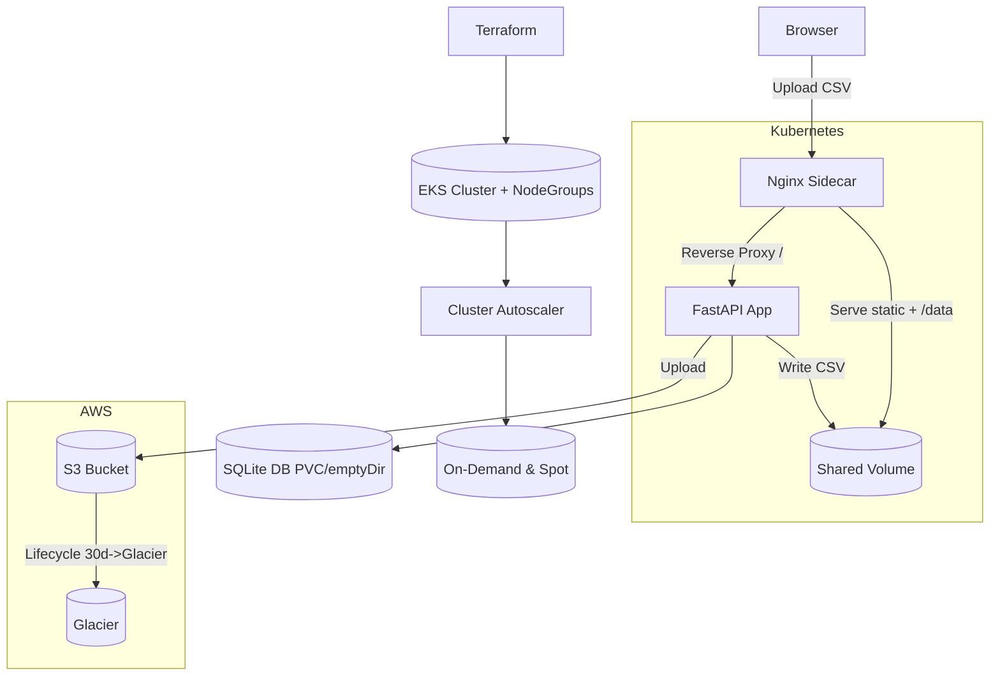

# Architecture Diagram

## Notes
- Terraform defines S3 bucket (with lifecycle) and EKS skeleton.
- Helm deploys app + sidecar + optional PVC + autoscaler.
- SQLite persistence stored on PVC when enabled.
